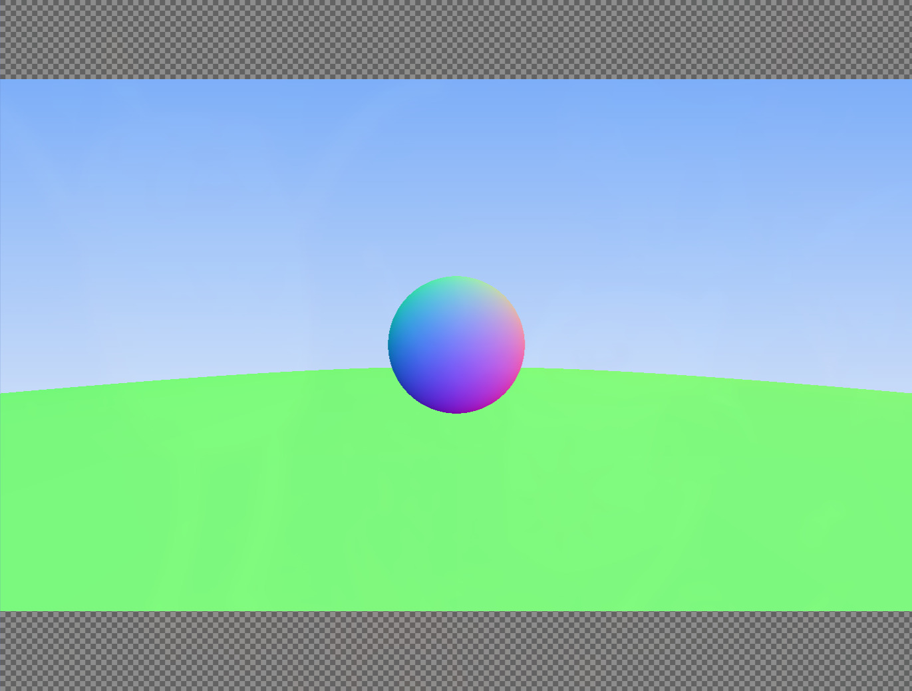
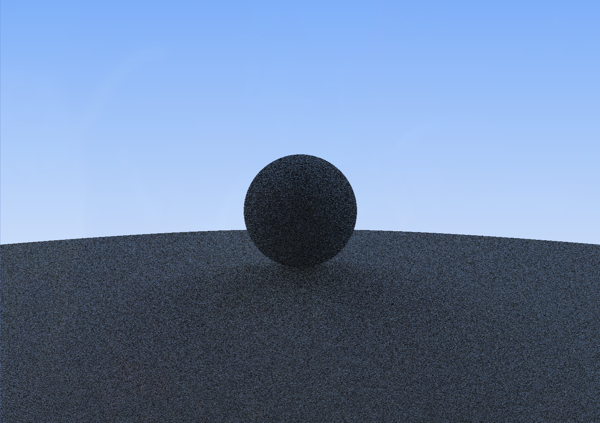

# Ray Tracer

A small C++ path tracer built from scratch.

## Materials

### Normal Map



### Lambert / Diffuse




## Quick Start

```bash
./build.sh
```

This configures the project with CMake, builds the executable, runs it, and writes the output to `build/image.ppm`. Open it in any PPM viewer (the script uses `feh`).

For a manual build:

```bash
cmake -B build -S .
cmake --build build
./build/app > build/image.ppm
```

## Requirements

- C++17 compiler
- CMake 3.10 or newer

## Resources

- [Ray Tracing in One Weekend](https://raytracing.github.io/books/RayTracingInOneWeekend.html) by Peter Shirley